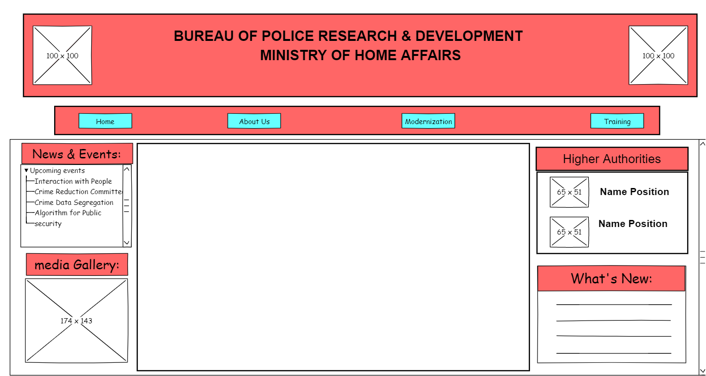

# Wire frame for a website

## AIM:
To design a wire frame for a website.

## DESIGN STEPS:

### Step 1:
the design is done using pencil project application.

### Step 2:
The layout of the website is done using "desktop sketchy GUI"

## OUTPUT:
HOME

ABOUTUS

MODERNIZATION

## Result:
Thus a wire frame is designed for a given website.
